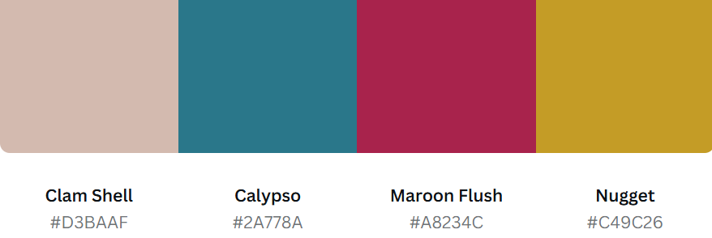
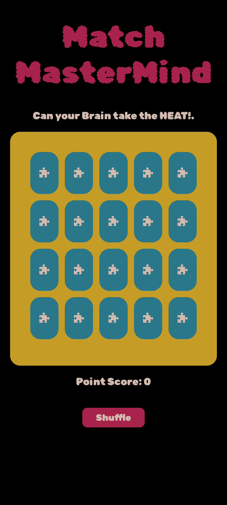
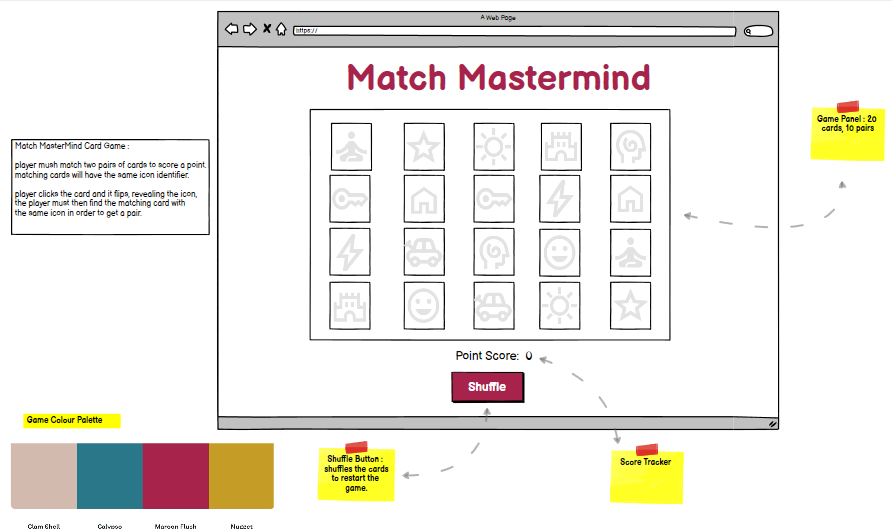

# Match Mastermind
| Technology Stack |                                                                                                                                          |                                                 |
|-------|---------------------------------------------------------------------------------------------------------------------------------------------------|-------------------------------------------------------------|
| 1     |  HTML 5                            |                    
| 2     | CSS 3                                              |
| 3     | JavaScript                                                 | 

## Description
Test your short term memory with this fun interative card game. The purpose of the game is to match two card pairs in order to score a point, if the two cards you pick do not match however! then they are hidden again. Relying on your memory to memorise where you **THINK** you may have seen the matching card.

The purpose of this project was to create a game where a user can interact, clear the game board of all matching pairs, score points and have fun while doing so. Games such as this one offers many benefits, proving to boost skills like **reasoning**, **problem solving**, **memory**, and **concentration**.

As outlined above Technologies used where essential in the development of this game. **HTML 5** brought structure to the page dividing the main game board panel and all its individual cards. Attributes where then added like <em>#id</em> and <em>.classes</em>, which allowed **CSS 3** to target and style all assigned attributes as well as its elements in the structure making the game more visually appealing and fun. 

**JavaScript** then brought interativity to the game, making it the most vital technology for the overall functioning, with out it the game would not run. My **biggest** and only challenge when developing this game was JavaScript. I continune to find it difficult to grasp its concepts which involves a lot of logical thinking. There is many features I would of liked to add to the game, but due to my struggle with the language ive had to put these features down for future addons. 

- Animation/sound effects on flip cards and where pairs are matched.
- Streak points, meaning that extra points are awarded to the player if they match pairs at a fast pace.
- Card flip effect, where it rotates to display the back of the card.
- Timer, given the playing a specific time to find the matching card before the cards reset, this adds difficulty.

These are a couple of features I would like to add as my skill set in JavaScript progresses and I build my confidence. However, overall I enjoyed developing this game, once it was functional I felt an huge sense of achievement which has motivated me to continue to try and master JavaScript as I can not help but feel that I am preforming magic with this language. :D

## Design

### Colour Palette

### Typography

"Rubik Bubbles", serif;

### Functions

### WireFrame

